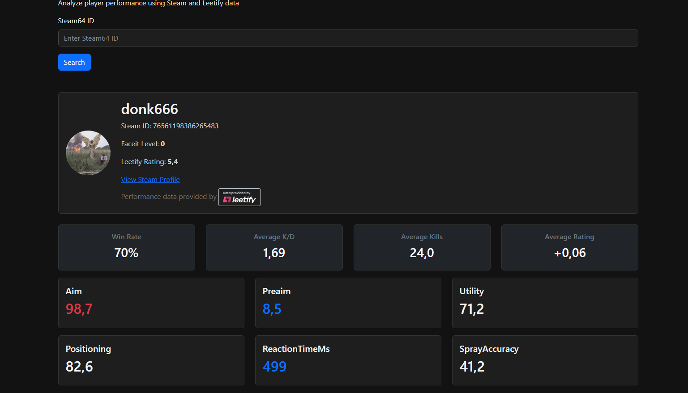
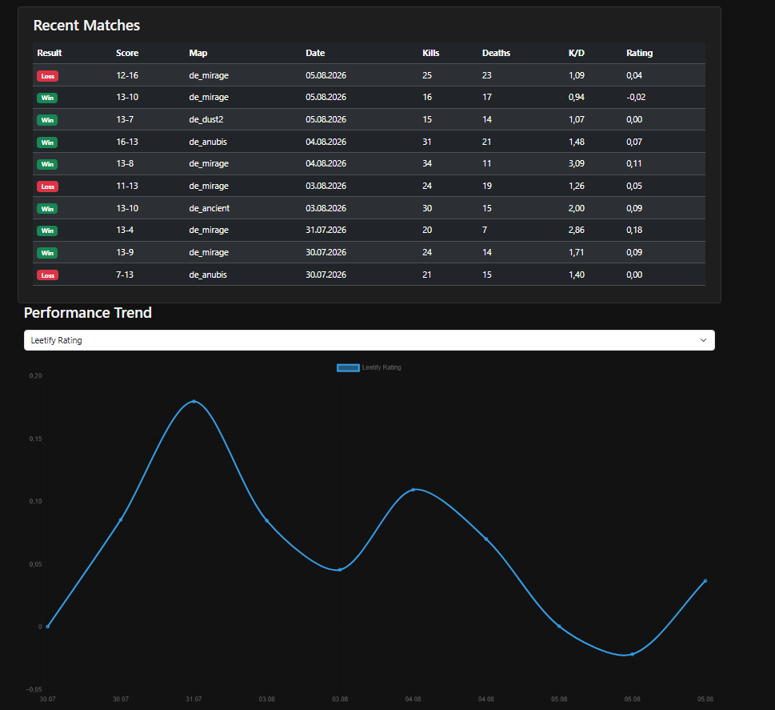

# CS2PerformanceTracker

A CS2 player performance tracking application built with ASP.NET Core and C#.

The application allows users to search for Counter-Strike 2 players using a Steam ID, Steam profile URL, or Steam vanity URL, and retrieves player statistics from Leetify.

## Dashboard

The dashboard provides an overview of player performance, including Steam profile information, Leetify statistics, performance summaries, and recent matches.

## Performance Analytics

The application provides interactive performance trends where users can switch between different metrics such as Leetify Rating, K/D ratio, kills, and deaths.

## Features

- Search players using:
  - Steam64 ID
  - Steam profile URL
  - Steam vanity URL
- Resolve Steam users through the Steam Web API
- Retrieve player statistics from Leetify API
- Dashboard displaying player performance metrics
- ASP.NET Core MVC frontend with Razor Views

## Tech Stack

### Backend
- ASP.NET Core Web API
- C#
- Steam Web API
- Leetify API

### Frontend
- ASP.NET Core MVC
- Razor Views
- Bootstrap

## Project Status

Currently building the foundation for a CS2 performance tracking platform.
Future improvements include advanced statistics, performance trends, and AI-based player insights.
